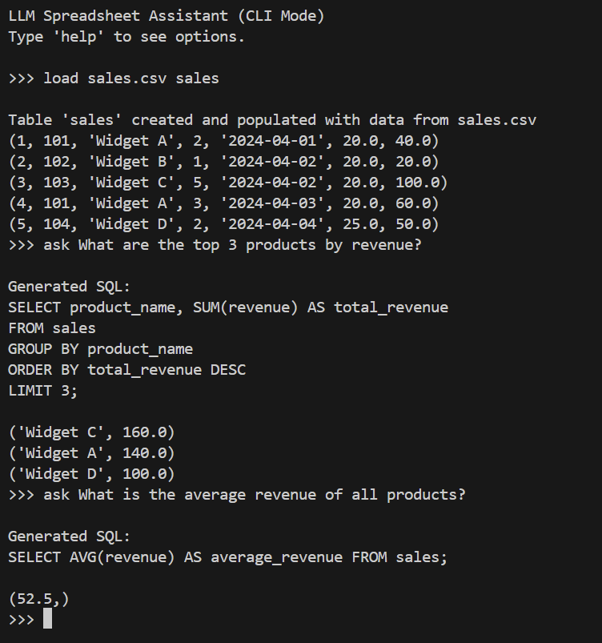

# LLM-Powered Spreadsheet Assistant

This is a command-line tool that mimics a spreadsheet-like experience powered by natural language. Users can load CSV files into a SQLite database and query them using plain English via GPT or raw SQL.

## Features

- Load and inspect CSV data
- Dynamically infer and create SQLite tables from CSVs
- Handle schema conflicts interactively (overwrite, rename, skip)
- Ask natural language questions and get SQL automatically generated and executed
- Log errors to `error_log.txt`

## Screenshot




## Setup

1. **Install dependencies**:
   ```bash
   pip install openai python-dotenv pandas
   ```

2. **Add your OpenAI API key to a `.env` file**:
   ```
   OPENAI_API_KEY=sk-your-key-here
   ```

## Usage

Run the app:

```bash
python app.py
```

You'll enter an interactive CLI. Available commands:

```text
>>> load <csv_file> <table_name>    # Load and infer a SQLite table from a CSV
>>> tables                          # List all current tables
>>> query <SQL>                     # Run any raw SQL
>>> ask <question>                  # Ask a natural language question (uses GPT)
>>> exit                            # Exit the assistant
```

Example:

```text
>>> load sales.csv sales
>>> ask What are the top 3 products by total revenue?
```

## Project Steps

### Step 1: Load CSV Files into SQLite

- Load CSV with `pandas.read_csv()`
- Write to SQLite with `to_sql()`
- Run basic queries

### Step 2: Dynamic Table Creation from CSV

- Automatically infer schema from the CSV
- Generate and execute `CREATE TABLE` statements
- Map Pandas types to SQLite types

### Step 3: Handle Schema Conflicts

- Detect if a table exists
- Prompt user to overwrite, rename, or skip
- Log invalid inputs or errors to `error_log.txt`

### Step 4: Add Chat-style CLI

- Input loop to simulate assistant
- Support for loading data, listing tables, running SQL, and exiting

### Step 5: Add LLM-Powered SQL Generator

- Use OpenAI GPT to translate natural language to SQL
- Run and display results of AI-generated queries

## Sample Data

`sales.csv` is included and contains fields like:

- `product_id`
- `product_name`
- `quantity`
- `price`
- `revenue`
- `sale_date`

Make sure your queries align with these column names.

## Notes

- Requires an OpenAI API key (GPT-3.5+)
- Set your API key in `.env`
- Make sure your usage quota isn’t exceeded
